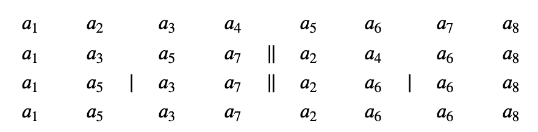

# Ímpar/Par Sorting

**Número da Lista**:  11<br>
**Conteúdo da Disciplina**: D&C<br>

## Alunos
|Matrícula | Aluno |
| -- | -- |
| 18/0103580 |  Jonathan Jorge Barbosa Oliveira |
| 19/0063441  |  Ana Carolina Carvalho da Silva|

## Sobre 

O _Ímpar/Par Sorting_ foi proposto na [seletiva](https://codeforces.com/group/btcK4I5D5f/contest/295070/problem/I) de maratona de programação feita pela UnB em 2020. 

___

Considere uma sequência de inteiros _𝑎𝑡={𝑎1,𝑎2,…,𝑎𝑁}_, onde _𝑁=2𝑘_ para algum _𝑘_ inteiro não-negativo. _Ímpar/Par Sorting_ é um algoritmo que ordena a sequência _{𝑎𝑡}_ da seguinte forma:

1 - todos os elementos cujos índices são ímpares são movidos para a primeira metade, mantida a ordem relativa entre eles;
2 - os elementos cujos índices são pares são movidos para segunda metade da sequência, mantida a ordem relativa entre eles;
3 - os passos 1 e 2 são repetidos para as subsequências _𝑏𝑖={𝑏1,𝑏2,…,𝑏𝑁/2}={𝑎1,𝑎3,…,𝑎𝑁−1}_ e _𝑐𝑗={𝑐1,𝑐2,…,𝑐𝑁/2}={𝑎2,𝑎4,…,𝑎𝑁}_, enquanto estas subsequências tiverem dois ou mais elementos.

Abaixo segue as etapas do _Ímpar/Par Sorting_ para _𝑁=8_:

<p align="center">

</p>

Dados os valores de _𝑁_ e dos elementos da sequência, ordene-a utilizando o _Ímpar/Par Sorting_.

## Screenshots

## Instalação 

**Linguagem**: Javascript
**Framework**: Node

É necessário a instalação do Node.

Para clonar e rodar a aplicação, são necessários: [Git](https://git-scm.com), [Node](https://nodejs.org/pt-br/) instalados.

Para rodar o projeto você precisará rodar os seguintes comandos no terminal do seu computador:

#### Clone este repositório
```bash
cd ~/your/directory/
git clone https://github.com/projeto-de-algoritmos/D-C_Dupla_ImparParSorting.git
````

#### Vá para o diretório da aplicação
```bash
cd .D-C_Dupla_ImparParSorting
````

#### Construa a aplicação

Em abas separadas do terminal você deverá rodar:

``` bash
    cd D-C_Dupla_ImparParSorting/backend 
    npm install
    npm start
```
``` bash
    cd D-C_Dupla_ImparParSorting/frontend
    npm install
    npm start
```

#### Acesse o seguinte link em seu navegador

O servidor poderá ser acessado em http://localhost:3000 enquanto o frontend será acessado em http://localhost:8080

## Uso 


## Contribuintes 

[ <br> <sub> Ana Carvalho </sub>](https://github.com/anacarolcs)|[ <br> <sub> Jonathan Oliveira </sub>](https://github.com/Jonathan-Oliveira) |
| :---: | :---: |
